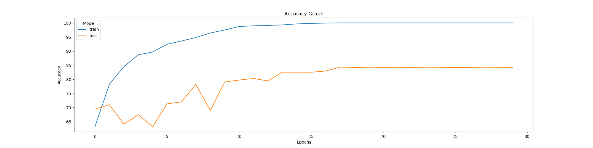
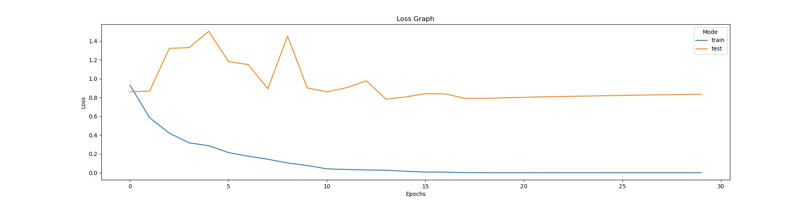
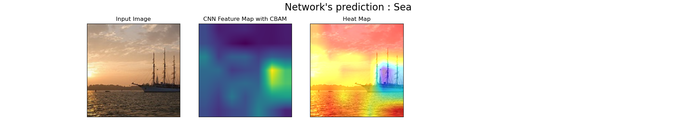
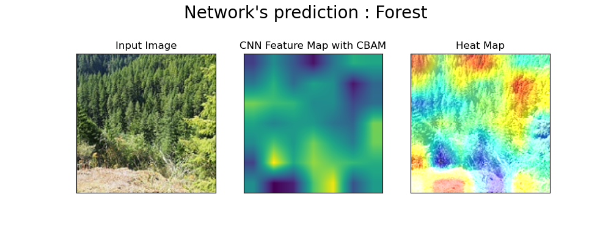
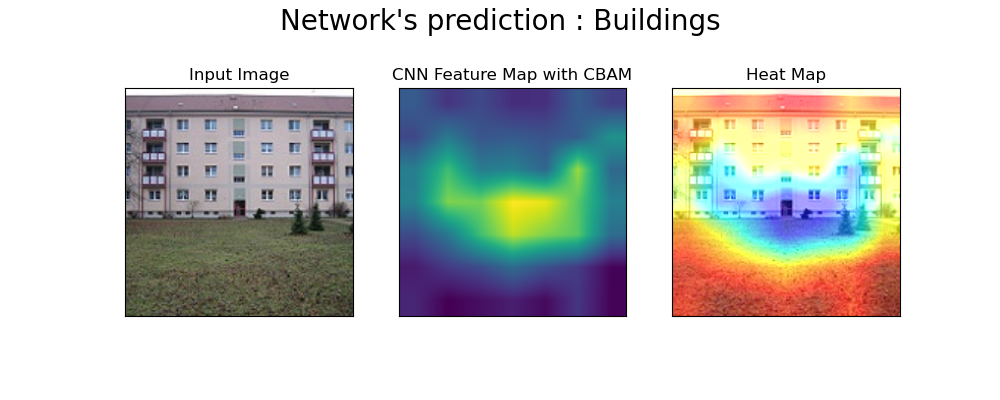
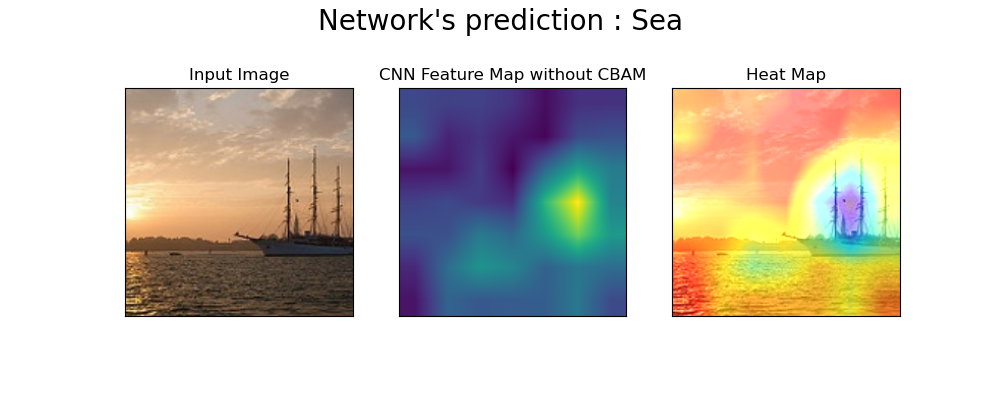
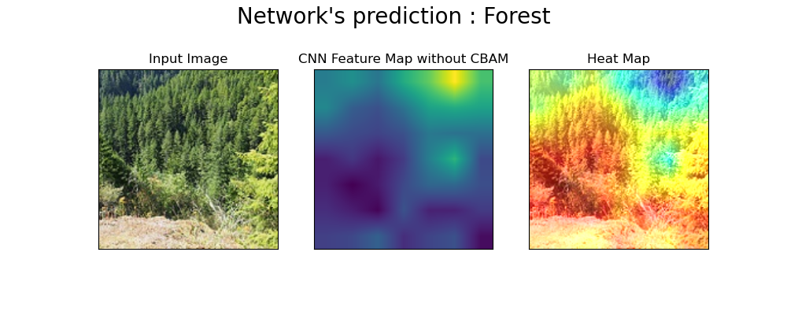
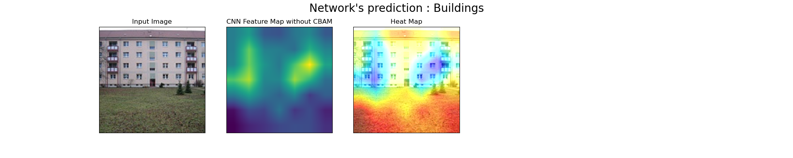

# ResNet-50 with CBAM using PyTorch 1.8

## Introduction
This repository contains the implementation of ResNet-50 with and without CBAM. Note that some parameters of the architecture may vary such as the kernel size or strides of convolutional layers. The implementation was tested on Intel's Image Classification dataset that can be found [here](https://www.kaggle.com/puneet6060/intel-image-classification). 

### Pretrained Weights
The trained models' weights are provided [here](https://drive.google.com/drive/folders/1Bp6FkNEcxdUNt4M6K43F6v0dEEwL-64a?usp=sharing). 

## How to Use
 In order to train your own custom dataset with this implementation, place your dataset folder at the root directory. Make sure that your dataset is split into two subfolder. `train` and `test` where the former contains your training dataset and the latter contains your validation set. Refer to the folder named `intel_dataset` in the repo as an example.
 
 If you wish to train the model without CBAM, you can do so with
 ```
 python train.py --data_folder [YOUR DATASET FOLDER NAME] --gpus [NUMBER OF GPU]
 ```
 To train the model with CBAM, run
  ```
 python train.py --data_folder [YOUR DATASET FOLDER NAME] --gpus [NUMBER OF GPU] --use_cbam
 ```
 
 There are more arguments that can be supplied to the command. Run 
 ```
 python train.py -h
 ```
 for more information.
 
 If you wish to visualize the final layer of feature maps produced by the **trained** model, create a folder in the root directory and simply place your images inside it and run
 ```
 python visualize.py --data_folder [FOLDER NAME] 
 ```
 Additionally, if the model was trained on CBAM architecture, then add `--use_cbam` at the end of the command above.


## Performance
ResNet-50 **with** CBAM achieved an accuracy of **86.6%** on the validation set while ResNet-50 **without** CBAM achieved an accuracy of **84.34%** on the same validation set. The figures below show the improvement of the models over the epochs.

<div align="center"> 
<b>ResNet-50 Without CBAM</b>
</div>
<figure class="image">
  
  <div align="center"><figcaption>Accuracy over 30 epochs</figcaption></div>
</figure>

<figure class="image">
  
  <div align="center"><figcaption>Loss over 30 epochs</figcaption></div>
</figure>

------------------------------------------------------------
<div align="center"> 
<b>ResNet-50 with CBAM</b>
</div>
<figure class="image">
  
  <div align="center"><figcaption>Accuracy over 30 epochs</figcaption></div>
</figure>

<figure class="image">
  
  <div align="center"><figcaption>Loss over 30 epochs</figcaption></div>
</figure>

## Visualization
 The figures below are the feature maps of the final convolutional layer of both ResNet-50 without CBAM and ResNet-50 with CBAM.
 
 <div align="center"> 
<b>ResNet-50 With CBAM</b>
</div>
 <figure class="image">
  
</figure>
 <figure class="image">
  
</figure>
 <figure class="image">
  
</figure>

------------------------------------------------------------
 <div align="center"> 
<b>ResNet-50 Without CBAM</b>
</div>
 <figure class="image">
  
</figure>
 <figure class="image">
  
</figure>
 <figure class="image">
  
</figure>


 


